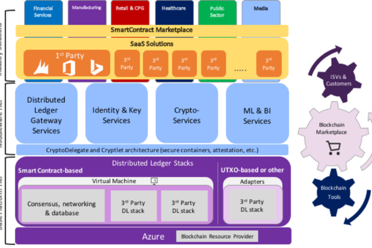

关于区块链的一些思考

目录
<!-- TOC depthFrom:1 depthTo:6 withLinks:1 updateOnSave:1 orderedList:0 -->

- [1. 概述](#1-概述)
- [2. 现状](#2-现状)
	- [2.1. 以太坊区块链](#21-以太坊区块链)
		- [2.1.1. 区块链：从入门到精通](#211-区块链从入门到精通)
			- [2.1.1.1. 什么是区块链（Blockchain）？](#2111-什么是区块链blockchain)
			- [2.1.1.2. 什么是以太坊（Ethereum）及其开发者大会（Devcon2）？](#2112-什么是以太坊ethereum及其开发者大会devcon2)
			- [2.1.1.3. 以太坊紫色革命](#2113-以太坊紫色革命)
			- [2.1.1.4. 智能合约的安全](#2114-智能合约的安全)
			- [2.1.1.5. Web 3：去中心化的下一代Web基础设施](#2115-web-3去中心化的下一代web基础设施)
			- [2.1.1.6. 微软BaaS – Bletchley](#2116-微软baas-bletchley)
	- [2.2. IBM区块链](#22-ibm区块链)
		- [2.2.1. IBM与微软：区块链领域的前瞻者](#221-ibm与微软区块链领域的前瞻者)
	- [2.3. Microsoft区块链](#23-microsoft区块链)
		- [2.3.1. 加密的安全共享分布式分类帐](#231-加密的安全共享分布式分类帐)
		- [2.3.2. 微软借Bletchley项目将云计算信息加入区块链](#232-微软借bletchley项目将云计算信息加入区块链)
		- [2.3.3. 微软介绍Bletchley区块链项目](#233-微软介绍bletchley区块链项目)
		- [2.3.4. 微软Azure发布NXT区块链节点，角逐云计算和金融科技](#234-微软azure发布nxt区块链节点角逐云计算和金融科技)
		- [2.3.5. 为什么选择 Azure 提供的区块链即服务？](#235-为什么选择-azure-提供的区块链即服务)
	- [2.4. 公证通区块链](#24-公证通区块链)
		- [2.4.1. Factom设计目标](#241-factom设计目标)
		- [2.4.2. Factom如何保障条目的安全记录？](#242-factom如何保障条目的安全记录)
		- [2.4.3. 证明否定](#243-证明否定)
		- [2.4.4. 应用程序如何验证Factom链？](#244-应用程序如何验证factom链)
		- [2.4.5. Factom联合服务器如何管理链？](#245-factom联合服务器如何管理链)
		- [2.4.6. 小结Factom将兼容比特币和以太坊区块](#246-小结factom将兼容比特币和以太坊区块)
		- [2.4.7. 小结](#247-小结)
- [3. 问题](#3-问题)
- [4. 改进](#4-改进)

<!-- /TOC -->

# 1. 概述

此前一直在做商业前置机系统开放接口的二次开发工作，对于国际上软件巨头对于区块链的应用方案与商业布局这一块几乎没有过多的关注，对于他们如果应用区块链知之甚少。不过，根据先前参与智能数字票据平台商业前置机开放接口的开发过程中的一些点点滴滴的感知来看，我觉得区块链技术要大范围的应用与推广必须与云计算平台结合起来，让区块链系统构筑在云平台之上。与此同时，做为新的技术，排除自身的缺陷之外，要全面推广，对已有各类应用系统的冲击很大，会面临巨大的阻力，如果区块链能以非侵入方式与现有各类系统进行整合的话，阻力会少的多，同时也会在很大程度上节约成本。提供纯区块链的服务给其他系统，是非侵入技术整合的一种方式。

经过一个礼拜的了解，上述一些个人猜想也部分得到了验证，比方说Mircrosoft提出了区块链即服务的理念，IMB也将自己的区块链与云平台结合起来，提供垂直领域的行业级解决方案，小蚁则是希望为中小企业在已有系统上添加一些区块链的能力，帮助他们完成由传统解决方案向混合区块链应用的过度。

接下来，我会从目前区块链的行业现状、区块链应用过程种遇到一些问题及通常情况一下的解决思路等方面简要做一个讲述。

# 2. 现状

区块链技术、人工智能、增强现实是时下三个比较新的技术领域，也是大家茶余饭后时常谈论的焦点。此前曾参加过一个基于虚拟现实的家居行业的应用平台的研发，去年10底在无意间应聘我们公司Java研发的同时接触并对区块链领域有了一些了解。人工智能领域大家谈论比较多的一个话题是机器学习。除此之外，新技术、新领域这些年几乎是层出不穷，记得刚接触Java的时候，Java EE、Strus、Hibernate、Spring、jQuery、WebService、云计算这些技术都还没有出现，此后几年时先后出现了上述的一些新技术，时过境迁，一些曾经火极一时的新技术正在逐渐的淡出人们的视野，还有些得到了长足的发展。所以，对于区块链的出现，我们应该以理性的视角与心态去了解它，掌控它，应用它。

区块链技术有很多激动人心的特性，个人觉得比较重要的有两个，一是防篡改，二是去中心化。很多时候，我们都习惯于将这两个特性捆绑在一起来看问题，如果是基于这样的思维模式去理解与应用区块链的话，可适用的场景与范围相对狭小很多，与其他系统的集成方面与会失去很多灵活性；如果我们将防篡改与去中心化这两个特性拿来单独去理解与应用的话，适用的范围会大大增加，应用灵活度也会特别容易把握。

接下来，我们简要看一下IBM、Mircrosoft、Factom、小蚁区块链的现状。

## 2.1. 以太坊区块链

### 2.1.1. 区块链：从入门到精通

#### 2.1.1.1. 什么是区块链（Blockchain）？

要说近期得到各行各业关注和讨论的热点，区块链必须算一个：迄今为止，2016年全球最大的投资项目都与区块链相关，投资金额分别在5500万美元和6000万美元，国内最大的一笔区块链项目也在9月底以超过2000万美元的投资规模宣布。

- 区块链的魅力在哪里？

若说今天的互联网是信息通过TCP/IP协议进行点对点的传递，是信息互联网，那么，价值（比如电子货币、电子资产等）怎样才能脱离第三方进行点对点的转移？区块链技术就提供了一种可能。

区块链是去中心的分布式记账系统。系统中的节点无需互相信任，通过统一的共识机制共同维护一份账本，每个节点都有一份完整的数据记录。区块链- Blockchain, 成块（block）的交易通过密码学算法连接在一起，使得整个账本公开透明、可追踪、不可篡改。

比特币作为全球通用的加密互联网货币，就是基于区块链技术发展起来的，而区块链上智能合约的支持，使更广泛的、比特币以外的数字资产的点对点转移变成现实，这就不难理解，为什么区块链技术会作为价值互联网的基石而引人注目了。

#### 2.1.1.2. 什么是以太坊（Ethereum）及其开发者大会（Devcon2）？

以太坊（Ethereum）作为全球最为知名的区块链项目之一，同时拥有全球最大的区块链开源社区。

什么是以太坊？它是一个有智能合约（SmartContract）功能的公共区块链平台。我们用智能手机打个比方，如果说以太坊好比智能手机的操作系统，那么智能合约就是上面打在的应用app。有了以太坊，用户可以直接开发自己的区块链应用，而无须担心底层的区块链系统。

此次是第二届以太坊开发者大会，不仅以太坊的核心团队成员悉数到场，还汇聚了来自世界各地的以太坊行业代表、开发者和社区成员。微软是此次大会的顶级赞助商，将与以太坊继续合作打造Microsoft Azure云端“区块链即服务”(BaaS: Blockchain-as-a-Service)。

#### 2.1.1.3. 以太坊紫色革命

以太坊创始人Vitalik Buterin 在会上发布了描述下一代以太坊（以太坊2.0）关键改进的紫皮书（Mauve Paper），直指以太坊存在的两大问题：

1. 以工作量证明（proof-of-work）为基础的共识机制低效、耗能、不绿色环保。
1. 以及以太坊公链系统吞吐量 （throughput）和容量均不足以支撑全球大范围高频次使用。

针对第一个问题，紫皮书提出一个新的基于权益证明（proof-of-stake）的共识机制，命名为Capser，能让参于“挖矿”的方式，从原来重金购入大量通用计算机或专门定制“矿机”并消耗电力能源进行大量“无用”计算来争夺区块的构造和收益权，转变成直接将资金兑换为以太币注入以太坊区块链，“挖矿”相关的智能合约（Smart Contract）自动根据资金的注入量成比例随机分配区块的构造和收益权。配合一套设计精巧、赏罚分明的经济学激励措施，这一新的共识机制有望使以太坊公链变得更安全、更高效和更绿色。

​不过，基于权益证明的新共识机制的复杂度显著高于基于工作量证明的现有共识机制，部分社区成员对新机制的可靠性和正确性还存有疑虑，仍有待投入大量精力和时间以共同完善和验证。

针对第二个问题，关于吞吐量和容量的局限，紫皮书提出了缩短区块产生间隔时间（block time）和分区（sharding）这两个解决方案。

在保证安全的前提下，新的算法把区块产生间隔时间从12秒降低为4秒，使吞吐量提升为现在的三倍。新的分区机制将区块链分为80个相对独立的分区（sharding），以太坊的每个节点无需处理全网所有事务（transaction）和储存全网所有的数据，只要关注其中一个或几个分区的事务和数据即可，所有节点通过分工配合来完成覆盖所有分区的目标。这么做能使以太坊的容量增大为现有的80倍。同时，由于各分区的事务可以并发处理，吞吐量再获提升，变为现有水平的240倍（3 X 80）。

但这么做也是有代价的：分区之前，一个事务无论涉及到多少个智能合约，对所有这些智能合约状态的修改都能原子化地完成，这个性质极大简化了智能合约的编程和推理。分区之后，一个事务如果涉及到跨区的智能合约调用，由于跨区调用只能通过异步的方式完成，一个事务会被分段执行而失去原子性，这在本质上改变了智能合约的执行模型，增加了推理和编程的复杂度。这就是扩容的代价。

尽管如此，作为价值互联网的核心基础设施，由以太坊代表的支持智能合约的区块链技术平台正以激动人心的速度不断突破技术难题向前发展，值得进一步的跟踪、研究与参与。

#### 2.1.1.4. 智能合约的安全

简而言之，智能合约就是一段用来直接控制电子资产交易的计算机代码。智能合约与区块链的关系可以类比为手机应用与智能手机，智能手机为手机应用提供计算平台，而多样的手机应用极大地丰富了智能手机的应用场景。类似地，智能合约可以和区块链技术无缝对接，使区块链可编程化、可定制化，智能合约因此赋予了区块链智能，使区块链可以突破汇款这一传统的应用，让区块链可以应用在更复杂的逻辑中。

智能合约区别于普通程序代码的强大之处，在于它被公开而不可更改地储存在区块链之上，在定义好的内外部条件下得到区块链全网节点的忠实执行。任何人都不可能单方面篡改和阻止智能合约的执行。这是智能合约值得信赖的根本原因，却也是智能合约的“天生缺陷”，因为这个性质使智能合约的漏洞不能得到及时修复，利用漏洞的攻击行为也难以被及时阻止，从而造成实实在在的危胁。

这方面已经有了实际的例子，最有代表性的就是The DAO攻击。The DAO项目作为区块链业界最大的众筹项目，目的是给基于以太坊的创业团队和项目提供重要的资源，但是其编写的智能合约存在“递归调用漏洞”的问题。不幸的是，在程序员修复这一漏洞及其他问题期间，一个不知名的黑客开始利用这一漏洞收集The DAO代币销售中所得的以太币，导致The DAO损失了接近5000万美元。为挽回巨大损失，以太坊社区采取了充满争议和极具道德风险的硬分叉（hard fork），回滚到攻击发生前的区块，重新生长出一条不包含攻击结果的区块链。新生成的链虽然符合社区的主流民意，但由于违背了区块链不可篡改的原则，至今仍然受到社区一部分成员的抵制。

​值得特别强调的是，这不是以太坊平台的本身漏洞，而是以太坊上某些智能合约出现了漏洞。新加坡国立大学的博士研究生Loi Luu在此次大会介绍了他关于智能合约安全性的论文，分析了以太坊区块链上19366个智能合约，发现大约44%的智能合约存在安全风险。

有效防范这些风险是智能合约得到广泛应用的前提，因此，开源社区和学术界一样都在抓紧解决智能合约的安全问题。由来自康奈尔、加州大学伯克利分校、伊利诺伊大学厄巴纳-香槟分校和以色列理工学院等学术机构的研究人员组成的IC3研究组在会上提出了解决智能合约安全问题的三板斧：对智能合约进行形式化验证，在智能合约中内建危机应对机制，建立发现和修补智能合约漏洞的激励机制。微软研究院、法国国家信息与自动化研究所和哈佛大学三个研究机构的研究人员也在近期共同发表文章，阐述在对以太坊智能合约平台本身（以太坊虚拟机）和智能合约的形式化验证方面进行了前沿探索。

#### 2.1.1.5. Web 3：去中心化的下一代Web基础设施

以太坊生态系统中的重要成员，去中心化储存系统Swarm，其核心开发者Viktor Trón在会上通过一系列演讲，描绘了一个以以太坊为核心的去中心化的Web愿景：Web 3。

​在这个宏大的愿景中，以太坊作为一个去中心化的计算平台，辅以Swarm和IPFS（InterPlanetary File System）作为去中心化的加密储存平台，以及以Whisper为代表的去中心化的消息传递平台，构成一整套以P2P网络为核心的下一代Web基础设施。基于这种基础设施开发的去中化应用（Dapps），直接使用由分布于全球的P2P网络提供的存储、计算和消息服务，具有高容错、抗攻击、高可用、反审查等特点。这使得去中化的应用开发者不再需要架设和维护专门的服务器，而是通过应用的使用者直接向P2P网络购买所需的计算和加密存储服务来使用这些应用，天然就获得了自己数据的拥有权和控制权。这跟现有的Web架构下，所有用户数据天然集中于由应用或网站的开发者架设和控制的服务器的情况，有着革命性的区别。让这一切成为可能的，正是以区块链技术为基础的全球性去中心化的电子货币系统。

Web 3作为一种去中心化的云计算平台，是对现有的集中式云计算平台的有益补充。现有的集中式云计算平台有着去中心化平台所不具有的低成本、高效率、高性能、功能丰富等特点，而去中心化的云计算平台由于不被单一实体控制，更适合构建中立性要求极高、跨机构的信任基础设施。这两者不是互相取代的关系，而是共存共生、相互借鉴而共同发展的关系。展望这两种云计算平台在未来的碰撞和交融，一定异常精彩，必将促进云计算技术和云计算生态系统的进一步发展，推动云计算技术更为深刻和广泛的影响人类生产生活的方方面面。

#### 2.1.1.6. 微软BaaS – Bletchley

重要的事情放在最后：微软一直积极支持整个区块链开源社区和生态系统的发展，今年已是连续第二届成为以太坊开发者大会唯一的顶级赞助商，不仅在自己的公有云平台Azure上推出了完全开放的区块链服务（Blockchain-As-A-Service），提供各种区块链项目和技术的一键部署和开发测试平台，还在这次大会发布了代号为Bletchley的区块链生态系统框架的V1版本。

微软的Bletchley框架，兼容所有区块链系统和技术，为这些区块链系统的落地商用提供访问控制、身份认证、加解密、智能合约安全验证、代码安全执行容器、开发调试、大数据分析和机器学习以及区块链应用及智能合约市场等服务，并以此为基础构建一整套第一方和第三方的相关软件服务以及各种行业解决方案。

​特别值得一提的是名为Cryplet的代码安全执行容器，它将基于硬件的安全隔离执行环境容器化，以按需云服务的方式，为区块链跟外部世界交互的关键代码提供一个任何人都无法窥探、篡改的安全执行环境。Cryplet不仅适用于将智能合约依赖的外部世界的事件（如股价、天气情况等）以安全和来源可验证的方式注入区块链，还能根据区块链状态安全和可信的操作外部世界和触发外部的事件。Cryplet的不可窥探性使其特别适合运行需要保密的私有算法和处理敏感的数据，大大的扩展了区块链系统的应用边界。除此之外，Azure也与中国区的区块链平台和创业公司合作，提供了本地化的区块链应用市场服务，方便本土的区块链系统在Azure上的一键布署，助力区块链技术在中国的发展。

## 2.2. IBM区块链

### 2.2.1. IBM与微软：区块链领域的前瞻者

在澳网公开赛的最后一场比赛中，两名老将取得了比赛的胜利，向年轻选手展示了其丰富的比赛经验。

我们现在谈论的是IBM和微软合作建立区块链即服务平台(BaaS)的案例。

商业世界并不像网球赛场，只允许有一个赢家。经验丰富的企业在市场中也不总是能占据领先地位，特别是在新兴市场领域。然而，IBM和微软这两家公司在最近联合起来支持企业级应用程序的云端产品，这突显了其对大客户的市场影响力和所拥有的特权。

IBM最近公布了其区块链领域的第一个商业应用程序，这是一套云服务应用程序，可帮助客户创建和管理区块链网络。

同时，自2015年以来，微软一直在为Azure云计算平台添加BaaS模块，使其在去年实现了对所有用户开放的功能。

这两个系统在表面上具有一定的相似性：模块化、云端数据存储、基于开放源代码，且具有庞大的生态系统。但其本质上具有很大的不同。

虽然微软的BaaS需要使用一系列协议来完成交易的过程，但它已经表现出对以太坊区块链的偏爱，并且于2015年实现了其在以太坊网络上的运行。

其最近的合作伙伴大部分都是以太坊为基础的初创公司，而微软则是企业以太坊联盟(Enterprise Ethereum Alliance)的创始成员，最近正致力于公共区块链项目的探索。

而另一方面，IBM在很大程度上是更倾向于私有区块链的。IBM和微软合作建立的区块链即服务平台(BaaS)是基于Hyperledger的Fabric代码库，其中IBM完成了大部分的代码编写工作。

这两个系统的差异是深层次的，并不仅仅是公有或私有区块链的区别。毕竟，微软和IBM都在开发私有的开源协议应用程序。

- 萝卜青菜各有所爱

其主要区别在于如何进行管理。

以太坊是由以太坊基金会(Ethereum Foundation)开发的，而微软并不是其成员。这是一个风险因素，因为基金会可以决定并更改以太坊的底层代码，而微软无法对其进行干预(微软不是Hyperledger联盟的成员，但IBM是其重要成员之一)。

两个系统对公众开放的程度不同，这也会导致额外的风险。相信这个问题会很快得到解决。另一方面，如果Fabric代码出现了错误，以太坊能够迅速地修正它，我们可能都不会意识到发生了什么。

也就是说，区块链与现有系统及其他区块链之间的互操作性，导致私有区块链无法解决所有的问题，所以许多人认为，公共区块链将会是最终的发展趋势。

在网球锦标赛中，比赛的双方参赛者都是专业的，比赛结果在比赛结束时就可以看到。然而，与简单的比赛不同，市场的获胜者需要经过很长的时间才能看得出来。

数百年来，IBM和微软共同成为了IT行业的领导者，同时，他们也互为重要的竞争对手，不断适应着新的战略和机遇。而在这个迅速发展的新兴技术领域，敏捷性非常重要。

## 2.3. Microsoft区块链

区块链是一种新兴方法，工商企业、实业公司和公共组织可通过它在近乎瞬间完成并验证交易，从而简化业务流程、节约成本并减小欺诈的可能性。作为该方法的核心，区块链是用于创建数字交易分类帐的数据结构，分类帐在分布式计算机网络中共享而不是存在于单一提供方。

这样就建立了一个更开放、透明并可公开核查的系统，它将从根本上改变我们对于交换价值和资产、实施合同以及跨行业共享数据的思考方式。使用区块链的应用程序几乎没有任何限制，适用范围从贷款、证劵和支付到更高效的供应链，甚至标识管理和验证。

### 2.3.1. 加密的安全共享分布式分类帐

- 加密可信

区块链采用行之有效的数字签名技术以创建交易、减少诈骗并建立信任和责任制。

- 共享

区块链在单个组织中几乎没有价值。参与的组织或公司（甚至竞争对手）越多，则流程越精简、价值越高。

- 分类帐

一次性写入且多次读取的数据库，它是每笔交易的不可变记录。如果记错，则必须发布补偿交易进行纠正（不允许更新或删除）。

- 分布式

副本越多，分类帐就越可信。

### 2.3.2. 微软借Bletchley项目将云计算信息加入区块链

在比特币领域大获成功后，越来越多的行业开始尝试通过区块链（Blockchain）技术在自己的业务中实施分布式分类帐（Ledger）。

- 什么是区块链

区块链是一种用于创建数字交易分类帐的数据结构，或有关某笔交易的记录。通过对每一笔交易进行数字签名可保障交易的真实度并防范篡改，因此分类帐本身和其中所保存的交易信息可以被认定是高度可信的。

当这些数字化的分类帐内容分散到整个部署或基础结构中之后，基础结构中的其他节点会对每一笔记录在任何特定时间内的状态获得“一致共识”，所有节点都会保存一份通过认证的现有分布帐副本。

在新增事务或编辑现有事务时，同一个区块链实现中的大多数节点需要通过某种算法对所处理的特定区块链区块历史信息进行评估和验证，同时需要一致认同历史信息和签名同时有效，随后才会接纳新的事务进入分类帐并在事务链中加入一个新的区块。如果大多数节点不认可对分类帐内容的增加或修改，这笔事务会被驳回，不被加入链。正是这种分布式一致模型使得区块链能在无需某种中央统一“权威”的情况下用作分布式分类帐，告诉我们哪些事务是有效的哪些是无效的。

比特币目前是区块链技术最主要的一个应用领域，比特币通常会提供一个匿名的，任何人均可使用的公开分类帐。为了在更小范围内进行较为私密的运用，很多组织会部署使用权限技术进行保护的区块链，并对可使用的人员和可执行的活动进行控制。

区块链技术目前面临最大的障碍是难以运用，这主要是因为作为一种开源技术，有不同团队按照不同想法以此为基础开发出大量项目，用户很难将自己需要的各种功能统一融入到一个具体的应用中。

- 微软的Bletchley项目

微软最近发起的Bletchley项目提供了一些能扩展区块链用途的工具。Bletchley是微软构建企业财团区块链生态系统所用的体系结构，而非一套全新的区块链堆栈。微软希望借此将分布式分类帐（区块链）平台纳入企业环境，在确保平台开放性的同时构建能解决实际业务问题的解决方案。

借此可以建立一个更开放、透明并可公开核查的系统，将从根本上改变我们对交换价值和资产、实施合同以及跨行业共享数据的思考方式。使用区块链的应用程序几乎没有任何限制，适用范围涵盖贷款、证劵和支付，以及更高效的供应链甚至身份管理和验证等各种领域。

该体系结构示意图显示了Bletchley项目的Cryptlets和融入区块链应用的中间层。

第一个工具“Cryptlets”是一组服务，可供企业在不危及系统安全性的情况下将外部数据引入区块链系统。Cryptlets可以使用任何语言开发，在一个安全可信赖的容器内运行。

随后还有一套中间件工具，企业可以通过这套工具为系统中添加非区块链系统原生包含的服务。这个中间件可以使用Cryptlets与区块链实现集成。目前微软已经通过这种方式为Bletchley增加了包括身份和加密服务在内的多种额外中间件服务。微软认为，通过这个中间件层，区块链系统将能为企业用户提供更大价值。

微软区块链业务开发和战略总监Marley Gray在一次采访中称：“这些新工具的发展演化可能会与互联网诞生后计算技术的演化类似，客户可以通过添加中间件弥补客户端-服务器体系结构的不足，区块链中间件最终也将造就强大的应用。”

目前微软已经与超过40家银行组成的财团：R3 CEV展开合作，开始将区块链作为一种服务供应给用户。

Cryptlets和中间件支持多种编程语言和云平台，这一特性也将为用户提供额外的收益。以后企业很可能在本地数据中心通过Azure Stack运行自己的Cryptlets，而不需要借助微软的公有云服务。

无论使用怎样的底层区块链平台，都可顺利支持Cryptlets和区块链中间件的运行。企业可以选择通过类似Ethereum这种支持Smart Contracts的区块链服务商实施自己的Cryptlets，但实际上微软提供的这些工具是不依赖特定服务的。

微软会在即将于下个月在多伦多召开的全球合作伙伴大会上公布有关Bletchley项目的进一步细节。

此外微软还通过Microsoft Azure发布了区块链即服务解决方案和种类丰富的模板可供用户尝试和使用。

### 2.3.3. 微软介绍Bletchley区块链项目

日前，微软商业发展和战略主管马利•格雷（Marley Gray）向全球区块链开发者、企业家详细介绍了微软的区块链平台——Bletchley。

Microsoft于6月15日公布了由自家云计算平台Azure驱动的开放式区块链平台，致力于帮助企业财团建设区块链生态系统体系结构。

在这里，从业者可以获得微软提供的开源基础架构，搭建可以通过区块链实现个人跟个人，以及组织跟组织之间的点到点交易体系，以及开发Dapp（去中心化应用）的接口。

除此之外，Microsoft所提供的一些特性包括：

- [x] 身份、密钥管理、隐私、安全、运营管理和互操作性等特性实现集成。

- [x] 性能、规模、支持、稳定性，这些均至关重要。

- [x] 财团（Consortium）区块链采用邀请制度，理想情况下仅获得许可的财团网络成员可以执行合约。

Marley Gray透露，Bletchley V1版本中加入了Cryptlets和Oracle这两个主要概念，其中前者主要为智能合约共识机制协议，后者是接入外部数据源的通道，是连接区块链主合约和外部世界的桥梁。通过Oracle和数据馈送，可以把真实世界的数据，代入到一个区块链。

具体的应用特性，可见以下Marley Gray演讲全文：

>首先我要跟大家介绍的是Middleware它是什么，去年在以太坊的第一届大会上发布了我们的BAAS，就是区块链作为服务这样的一个平台，然后我们也是非常兴奋的跟大家宣布了我们的Dapp的一些特色。我们用户的反馈，这里有非常多技术的细节，他们希望可以尝试。所以我希望最终帮助大家来更好的应用我们的平台。如果说你不尝试的话，你就没有办法进行创新。当然如果说你不创新的话，在这样的一个行业你是没有办法继续生存或者谋求长远的发展。
>
>我觉得作为我们的这个行业，事实上它非常的不错，因为我们有非常开源的基础架构，而且我们可以通过区块链实现个人跟个人，以及组织跟组织之间这种点到点的交易。当然我们知道区块链它本身也是有一些缺失的部分，如果说我们仅仅通过区块链这个平台来解决这些问题显然是不够的。比如说我们说数据库，作为数据库而言，事实上它有许多的一些功能。所以就跟我们的客户进行了了解，然后我们来了解一下他们觉得区块链缺失在那里，当然他们给我们列出来了他们的一些想法，虽然说不是很全面。
>
>首先，比如说他们需要安全的身份认证，无论是对于自己的身份认证，还是对我所持有物品的身份认证。我们知道事实上这些都是非常难以来解决的问题，所以我们需要对我们的密钥来进行一个适当的存储，而且我们要确保我们密钥全生命周期安全的管理。事实上作为我们微软而言，我们也是有这样的一些问题，所以我们希望可以对于我们创建代码的方法进行完善和创新，这样方便我们来写出更加安全、更加有效的代码。就是这样的一个过程，所以说在我们实现承诺的过程中，我们也是需要一些工具以及数据的服务。
>
>在这里跟大家非常高兴的宣布，我们这个BletchleyV1的第一个版本，大家看到事实上这个Bletchley，它是一个工人的名字，当然这个工人起这个名字，也是起到非常重要密码学的人物。在这里大家可以看到，在这个表上我列出来了关于Bletchley一些相关的内容。我们说在这样一个平台上，我们希望它是我们区块链一个核心的内容。因为刚刚来自超级账本的发言人也提到了，事实上没有唯一的区块链，事实上我们所有的这些链都应该共同来协作，使得区块链的协作可以通过不同的渠道，来建立他们不同的区块链。所以在这种情况下，我们就可以进行自由的创新，这就是我们跟我们的合作伙伴，目前正在做的事情。
>
>在此之上，我们还有一个团队，他们也是非常的帮，他们跟我们创建了一个平台，这个平台事实上跟区块链是没有任何关系的，无论是任何的区块链它都可以在这个平台上进行运作。当然还有我们的一些解决方案，所以Bletchley的第一版本，事实上就是我们讲以太坊联盟链的区块网络。如果说你把你的代码放到网络上的话，你如何确保你代码的安全呢？因为我们知道代码还有许多的问题亟待解决。我们看到有些时候可能有一些信息是需要进行保密的，在这里我们会问8个问题，这个问题是在5到8分钟进行提问。这个问题会问到网络的4到100个节点，问题的询问是以非常严肃的方式来提问的。
>
>事实上，这里我列出来右下角的网络，它是一个非常隐私或者私有的以太坊的联盟链。我们知道现在可以跟几百个交点进行交互，来看一下他们的联盟链应该如何来执行。
>
>另外一点就是讲的Flebic这个云，事实上希望可以帮助区块链来创立一些信息。在前两天的会议上我也提到了Cryptlet，一般在这种情况下会有智能合约来帮助我们实现功能，而且我们也会有一个间断的时间，比如说每15分钟。所有的这些都是我们讲的外部的市场信息，当然我们可以通过一个内部的系统，比如说CRM这样的一个系统，来对于我们客户的数据进行分析或者收集。
>
>当然，我们刚刚提到的就是可信的这样一些数据，当然我们是否也需要这样的一些可信任的执行呢？当然我们说是需要的，因为可信的执行对于各方来说是非常重要的，而且这个也是可以通过隔离或者通过其他对于应用程序的操纵来实现安全的执行。所以我们希望可以保护我们区块链上面应用的一个知识产权。同时也希望对于我们的交易可以在所有的节点上进行运行。这也就意味着说，我们需要对于我们的算法进行扩展，来实现最大的性能。还有我们需要进行比较复杂的一些互动，我们将会有一些分布式的应用，你可以在多重的区块链上对这个应用进行嵌入，你希望你的交易通过一个提交在所有的区块链上来实现，这是非常复杂的一个事情。事实上我们在这方面的研究也是进行了很久。当然我们也希望可以提高现有的这些企业使用区块链的一个性能以及他们的规模。
>
>接下来来看一下Cryptlet它是如何来工作，在这里我们有企业联盟链的网络，上面有一些区块链。没一次当市场停滞的时候，如果说今天市场开放的时候，我们就会开启智能合约。比如说我们需要获得黄金的价格，这个是非常重要的，所以在这种情况下，我们会介入Cryptlet。如果说我们要让3个交易对手都同意的话，我们需要这样的一个Oracle。
>
>在这里，假如说这个银行是Oracle，对冲基金他们有一些问题，所以在这种情况下，我们需要人们来相信说，我们的这个协议是一个安全的协议，或者说我们的主机是一个安全的主机。同时我们也希望这个Oracle是可以测试以及验证的，最终我们让所有的交易方都相信系统是可以安全运行的。
>
>所以这里大家看到，事实上这里有一个经验证的主机，它是在我们的Oracle的平台上进行运行的。这里可以简单的对比一下Cryptlet跟Oracle的区别，事实上Cryptlet它是非常标准的基础设施，我们可以进行非常清楚的界定，而且它可以作为开发者的一个平台来创建他们所需要的数据库或者是程序库。比如说，我们需要对这个市场创建一些新的程序应用，也是可以通过Cryptlet来实现的。
>
>这张可能比较技术一点，大家可以看到，这里有区块链的一个节点，它是通过Cryptlet来实现的。我们看到Cryptlet做了信任的信封，所以这个可以在你的台式电脑上运行，也可以在你的笔记本等不同的设备上来进行运行。这个是我们讲的一个Bletchley Cryptlet的Fabric，我们看到如果是现有的供应链的话，因为我们事实上也是支持以太坊，当然我们也会支持其他类型的区块链。所以这里大家可以看到，我们可以分解你们不同的忧虑，我们可以把你的Mist在不同的数据之间进行转移。通过Fabric可以实现这些能力，当然我们也可以通过一致的方式来实现所有的这些操作。
>
>讲到企业的规模，就是跟我们讲的企业联盟链相关。这里我们有一个WW超级规模的云，就是我们讲的Azure这样的云，大家可以看一下，事实上我们现在已经在全世界的30多个地区部署了这样的一个Azure的云，每年云的分布也是在不断的增长。执行非常快，同时有很多的选择，而且你还可以提升数据库在区块链网络上的一个弹性，能够扩展到其他的一些地理的位置。比如说，我们这里有数据中心，是由20亿Net来托管的，我们有客户的数据，交易的数据，可能必须在中国。但是如果你有全球区块链的话，你仍然还是可以交付。我们有很多这样的数据中心，这些都只是一些位置，我们大约是有100多个数据中心在全世界，大多数都是非常大规模的，高冗余的数据中心，你可能要亲身来看一下，才有可能知道数据中心到底有多大，我们区块链的结构是覆盖了全球。
>
>一些关键的观点，对于区块链、对于开发者和企业的生态系统意味着什么呢？如果企业想要拥有一个可靠的区块链网络意味着什么呢？首先是可以进行按需的，安全的执行。我们可以保证它的安全性，以及保证它的弹性和高性能，而且是一个安全数据的提供商，你可以获得市场的数据，还可以公布自己市场的数据。你可以创建以及消耗一些数据，所以你可以实时的比较价格。
>
>扩展性和灵活性，就是在代码执行的时候可以实现扩展性和灵活性。我们有一个Scale的架构，使你可以把担心的问题隔离开来。你还可以对于你的解决方案实行一定的架构来实现扩展性。同时我们是一个开发者友好的生态系统，我们支持所有的区块链，我们会支持他们喜欢的工具，让这些资源是可以扩展的，你可以创建自己的库公布它，这样其他人也可以找到你的库，你也可以发现现有的库。如果你需要一些应用功能的话，你在代码当中可以找到参考的代码，你就不需要担心Cryptlet在哪里，是否是安全，是否能够获得我所需要的这样一种高性能。还有一个标准的方式来发布以及获取外部的资源，这也是非常重要的一块儿。
>
>最后我想跟大家介绍一下我们微软的一个路线图，在今年年初的时候或者说在秋天的时候，我们发布了通用的这样一个区块链基于服务的，以及Dev Test Labs，不仅基于企业、开发者，它主要是基于联盟所以地可以创建Dev Test Labs，然后可以安全的创建，现在我们宣布了BeletchleyV1，我们和以太坊的社区可以一起向开放市场公布，同时提升安全性，同时也可以提升代码的生命周期，之后我们会有Bletchley的V1，谢谢大家邀请我们，希望大家今天过的愉快，谢谢！

### 2.3.4. 微软Azure发布NXT区块链节点，角逐云计算和金融科技

微软 Azure 是一个云计算和基础建设平台，以微软全球数据管理中心为基础，打造、部署及管理应用。Azure 正式宣布，将 NXT Blockchain 区块链节点带入平台。现在，全球的开发者第一次能够简单地开发自己的 NXT（未来币） 节点。

部署 Azure 的主要好处是，它可以省略大部分手动配置。在有 Azure 和其他所有云开发平台之前，用户首现必须找到一个主机供应商，安装一个 VPS（虚拟专用伺服器），然后完成远程软件配置和安装过程，有时候这个过程会很漫长。

有了 Azure，用户点击“配置”，所有基本安装任务都为你处理好了，这样就省去了几个小时的配置工作，你的 NXT 系统几乎是即刻装好，马上可以运行了。

Azure 云配置和传统配置之间的区别，就好像是买一辆汽车，与自己动手制造一辆汽车之间的区别。你懂。

NXT Blockchain 是一个开源区块链平台，从2012年就开始运行。用 NXT 基金会的 Dave Pearce 的话说，这是“加密货币中，最安全、最丰富的网络之一。”

NXT 基金会是一个非盈利组织，其使命是为 Nxt 区块链技术提供教育和信息，将区块链技术推向未来。另外，有了 NXT 社区的支持，Nxt 努力打造 Pearce 所说的“面向全球政府和企业的，安全、去中心化的平台”。

- NXT 的区块链

NXT 包含区块链唯一的“预编码”的模块化交易系统：包括了资产交易、交易商店、投票工具、短信系统、数据云、货币洗牌和其他特性。

当人们首次明显意识到，区块链技术的应用不只是简单的价值模型存储（换句话说，也就是比特币），人们看到“有两种可以深入的基本发展路径”，Pearce 说到。

“一方面，创造简单、可靠的模块化功能，带有有限的定制化功能，能覆盖所有使用情境的90%，”他解释道，“或者，通过一个完全可以编写脚本、可以编码的系统，试试100%覆盖区块链技术所有的应用情境。”

早在2014年，NXT 就讨论过这一点，并得出了以下的结论：（1）安全是万事之首，（2）创造一个完全可编码的系统——这也是以太坊（Ethereum）用过的方法——“这几乎不可能在确保安全的前提下实现”。不过，Pearce 坚信“这感觉是个很好的主意。”

微软 Azure 新增 NXT Blockchain 的决策，被人赞为让两个网络都实现”持续成长”。

Azure 提供 IaaS （基础设施即服务）和 PaaS （平台即服务）服务，支持许多不同的编程语言、工具和框架，作为一种开发者工具来说持续增长，而 NXT 已经踏出了加密货币的领域，进入了主流金融应用。

俄罗斯中央证券托管和国家结算存管所采用了 NXT 技术，用于一个在分布式账本（区块链技术）上运行的电子代理投票系统。此后，福布斯从 Pearce 处了解到，未来几个月，我们还能在主流金融领域内看到类似的项目。

- 将区块链技术规模化

开发者们已经在使用、试验简单的 NXT 节点，为 Ardor 作准备，Ardor 是可规模化的新的区块链技术，是以获得认可的 NXT 代码为基础。Ardor 开发者们正是过去几年中，进行了 NXT 开发的核心开发者。

Ardor是一个被称为“孩子链”（Child-Chain）的新平台，用户将能够创造自己的区块链技术。至于它的上线时间，有一个 Ardor Testnet 测试系统（是 Ardor 区块链的沙盘测试版本，可以重新清零）计划将于2016年底或2017年初上线，另外，2017年中或第三季度，将在 Mainnet （可随时量产的版本）上发布 Ardor。

另外，还有一些新的 NXT 项目正在开发中，目标于今年第四季度发布。

在微软 Azure 上应用 NXT 的能力，预计会在2017年为微软带来很多新的开发者和服务商。Azure 允许各方发布 NXT Node 和 Digital Ocean，这是一个2011年成立的云基础建设供应商，总部在纽约，为软件开发商提供虚拟服务器。

Digital Ocean 最初是一个主机供应商，租赁 VPS 系统。由于在全球各地有数据中心，他们进入了云部署市场，大大缩短了部署云系统、安装和维护 VPS 及其相关软件的流程和时间。说到这个话题，谷歌也正在进入云服务的市场。

感兴趣的人可以来试验一下 NXT：先安装一个 Nxt 节点，再使用微软 Azure，可以发现 NXT 并设立自己的节点服务器。而且，NXT 的 Slack 渠道还可以帮忙安装。

虽然 NXT 和微软在 Azure 部署上没有财务关系，前者自己必须自己创建 Azure 模版，并提交给微软进行审核。Pearce 估计投入在 Azure 的人力大约共有 100 小时。

截止在本文发布时，NXT 本身作为一种加密货币， 在过去24小时内交易量为 448,990 美元，单价为 0.012519 美元（上涨 6.76%），市值排名为领域内第 21 的货币。这项排名仅次于市值 12,747,274 美元的 BitShares（BTS），其 24 小时内交易量为 107,000 美元；但是，Nxt 排名在 Synereo 之前，Synereo 在最近的众筹活动中筹得超过 400 万美元，市值超过一千一百万美元。

### 2.3.5. 为什么选择 Azure 提供的区块链即服务？

作为一个开放、灵活且可扩展的平台，Azure 支持正在迅速增多的分布式分类帐技术，这些技术能够满足安全性、性能和操作流程方面的特定业务和技术要求。我们的智能服务（如 Cortana Intelligence 套件）能够提供其他任何平台都无法提供的独特的数据管理和分析功能。而巨大的 Microsoft 合作伙伴生态系统又在某种程度上扩展了我们平台和服务功能，从而满足特定的角色和行业需求。

区块链即服务 (BaaS) 提供了快速、低成本、低风险和快速失败的平台，以便各组织试用由云平台提供了业内最大的合规性组合支持的新业务流程，从而进行协作。

- 面向企业和业务网络的 BaaS

Azure 带有智能服务和工具，是用于开发、测试和部署区块链应用程序的云平台。在 Azure 应用商店了解区块链解决方案，进而了解 BaaS。

- 面向开发人员和合作伙伴的 BaaS

查找开发人员工具和兼容区块链的云服务，快速将解决方案大规模推向市场。通过 Solidity 和智能协定 (Smart Contract) 使用区块链入门。

## 2.4. 公证通区块链

公证通（Factom）是美国一家基于比特币的区块链技术，为商业和政府部门提供新的数据管理和数据记录解决方案的公司。

Factom利用比特币的区块链技术来革新商业社会和政府部门的数据管理和数据记录方式。利用区块链技术帮助各种各样应用程序的开发，包括审计系统，医疗信息记录，供应链管理，投票系统，财产契据，法律应用，金融系统等。开发者能够创造新的应用程序，并把数据保存在区块链上面，同时不用受到直接把数据写入比特币区块链的各种限制：例如写入的数据速度，成本，大小等限制。

Factom维护了一个永久不可更改的、基于时间戳记录的、区块链数据网络。大大减少了进行独立审计、管理真实记录、遵守政府监管条例的成本和难度。
商业社会和政府部门可以利用Factom简化数据记录的管理，记录商业活动，并解决数据记录安全性和符合监管的问题。

区块链提供了一个分布式的机制进行数据锁定，使数据可以被核查和独立审计。比特币区块链是现存最值得信赖的不可变的数据存储，但这往往只限于比特币交易上。 Factom能使企业获得最新的区块链技术，而又无需在采用虚拟货币的问题上陷入麻烦。

Factom创建了一个分布式的，自治的协议，完成了将比特币区块链从Bitcoin网络中剥离。

### 2.4.1. Factom设计目标

Factom设计目标是用Factom创建更快，更便宜，无膨胀的方式来开发区块链应用。

中本聪推出的比特币区块链彻底改变了交易记录的方式。在这以前从未存在过永久的，分散的，和无需信任的分类账。开发商纷纷开始开发建立在这个分类帐之上的应用程序。不幸的是，由于比特币一些初始的设计权衡， 他们已经碰到了几个核心的约束和问题：

1. 速度 – 因为比特币的分布式设计和工作量证明的共识方法，工作量难度会被调整到以保持大致10分钟确认时间。对于希望更大的安全性的应用中，多个确认可能是必需的。一个常见的要求是要等待6确认，这可能会导致等待时间超过一个小时。

1. 成本 – 默认的交易成本大约是0.01 mBTC（约0.003美元美元于2014年11月）。 BTC的交易价格一直不停的波动。如果BTC的价格上涨，则交易成本也上去了。这对需要管理非常大的数字交易数据的应用程序来讲， 是一个严重的成本障碍。此外，还有许多因素，如对区块大小的限制和奖励减半等，会导致交易费用增加。

1. 区块链膨胀 – 比特币区块大小限制目前是1MB，交易流量的上限是每秒7交易。任何应用程序想要使用区块链写入和存储信息都将会增加流量。这个问题已致使各方寻求增加区块大小限制。

Factom是旨在解决这三大核心约束的协议。 Factom协议为应用程序提供的功能和特性超越了虚拟货币。 Factom构建了一个标准的，有效的，安全的基础，这将使应用程序的运行速度更快，更便宜，并且不会造成区块链膨胀。

### 2.4.2. Factom如何保障条目的安全记录？

Factom把比特币的功能拓展到其货币属性之外的事件记录的功能。 Factom设有最小的规则集，用于永久记录数据条目。 Factom让客户的应用程序来执行大多数的数据验证任务。唯一Factom强制实施的验证是那些通过协议要求交易Factoids，购买条目信用，并确保条目正确付款和记录。

Factom具有关于激励运行网络和内部一致性的一些规则，但它不能检查用户记录的信息本身的真实性和有效性。

Factom把比特币矿工做的事情分为两个任务：按照顺序记录条目和审计条目的有效性。

1. Factom服务器接受数据条目，并将它们装入到不同的区块，并修复条目的顺序。 10分钟后，该条目的顺序通过插入到比特币区块链的一个锚定而变得不可逆转。 Factom通过对10分钟内收集的数据创建哈希值，然后把这个哈希值记录到比特币的区块链来实现这个功能。

1. 条目的审计是一个独立的过程，可以依靠信任第三方或不依靠信任第三方来完成。审计是至关重要的，因为条目在被包括在Factom数据集之前， Factom是无法验证它们的真伪的。

以信任为基础的审计，轻型客户端可以信任他们选择一个称职的审计师。一个项目被输入到系统中以后，审计人员将可以验证输入是否有效。审计师将提交自己的加密签名条目。签名会显示该条目通过了所有审计师认为需要做的的检查。审计要求的条件实际上可能是一个Factom链的一部分。以之前的房地产为例，审计师会仔细检查财产转移是否符合当地标准。审核员将公开证明，财产转移是有效的。

不依靠信任的审计系统将类似于比特币网络。如果一个系统的有效性像比特币网络的数学定义一样完美，那么它可以实现程序化的审计过程。如果用于转移的规则能够由计算机进行审核，则应用程序可以下载有关的数据，并进行自我审计和审核过程。该应用程序可以通过下载数据条目，验证数据条目，并决定条目是否有效，从而使该应用程序建立起对系统的感知。

Mastercoin, Counterparty, 和Colored Coin也有类似的信任模型。这些都是基于客户端的验证协议，这意味着交易被嵌入到比特币的区块链上。比特币矿工不审核其有效性；因此，基于这些协议的无效的交易如果被故意设计伪装成有效的交易也可以嵌入到比特币的区块链上。支持这些协议之一的客户端通过对区块链扫描并寻找潜在的交易，检查它们的有效性，并对控制这些数字资产的地方建立说明和解释（通常是一个比特币地址）。在这些协议中，都是由客户端来执行自我审计。

要把这些由客户端验证的协议搬到Factom上，将会只是一个如何定义协议中的交易并建立一个链来保存交易的问题。和比特币相比，交易协议在Factom下不会有太大的不同。不同之处在于信息在Factom上很容易表达，而不必以某种特殊方式对其进行编码并嵌入比特币的交易信息中。

### 2.4.3. 证明否定

比特币，土地登记，以及许多其他系统需要解决的一个根本性的问题：证明否定。他们证明了某个“东西”已经被转移到某个人，并证明这个“东西”还没有被转移给其他人。在无界系统里，否定的证明是不可能的，而在一个有界系统里它是很有可能的。 加密货币通过限制交易数据可以存在的地方来解决这个问题。比特币交易只能在比特币区块链里找到。如果某个交易没在比特币区块链里被找到，那它在比特币协议下就不存在，因此，该比特币就尚未被发送两次（双花）。

某些土地所有权记录系统是相似的。假设在一个系统里，土地转让要在政府登记，而且法律制度规定，未记录的转让是无效的（sans litigation）。如果一个人要检查某个产权是否明确（即，没有其他人声称这片土地所有权），答案就在政府登记处。利用政府记录可以证明为否定，土地不被第三方拥有。如果产权登记不是必须的，政府的注册表只能证明什么已被登记。私人转让很可能存在，注册表也就不能代表全部的转让情况。

在上述两种情况下，否定可以在某个环境中得到证明。以万事达币（Mastercoin）为例，这个证明是强而有力的。而土地登记，则仅限于被注册的环境下，可能遭到一定的质疑和挑战。现实世界是复杂的。Factom的设计，针对的不只是精确的数字资产，而且是物质的世界中复杂的现实情况。

在Factom中，数据分类有层次结构。 Factom只在链中记录数据条目；诸多用户定义的链在Factom执行的协议中没有互相依赖关系。这不同于比特币，每一笔比特币交易是都存在潜在的双重支付，因此它必须被验证。和把所有数据合并在一起成一个总账相比，Factom通过把条目放到多个链当中，可以让应用程序在较小的空间内搜索数据。

如果Factom要用来管理土地转让，使用某个链来记录的应用程序可以安全地忽略在其他链上的条目，比如那些本来用于保安摄像机的记录的链就不与需要更新。如果政府法庭判决需要变更土地转让记录，那么和其相关的链将被更新，以反映上述判决的结果。但更改的历史不会丢失，并且如果这样的土地产权变更的更改从法律或其他角度来讲无效的话，它的记录的内容和顺序在Factom上都不能被更改或隐藏。

### 2.4.4. 应用程序如何验证Factom链？

Factom不验证条目；条目是由用户客户端和应用程序来验证的。只要应用程序了解并熟知该条链应遵循的规则，那么无效条目的存在也不会引起不合理的干扰。在链里的不遵守规则的条目可以被应用程序忽略。

用户可以给他们的链设置任意规则，并且可以使用任意方法给这条链的用户传达这条链的规则。在这条链中的第一个数据条目可以被设计成这条链的一组规则，或某个审计程序的哈希值，等等。这些规则可以被应用程序理解，并通过运行Factom，在网络中忽略掉不符合这些规则的客户端应用程序。

强制执行的序列可以在每条链的规则中指定。不符合这种顺序规定的条目将被应用程序拒绝。然而，那些被规则或审计程序拒绝的条目仍可能被Factom记录在这条链上。这种链的用户将需要运行审计程序，来验证这种序列。Factom服务器将不会使用审计程序来验证此类规则。

上面所述的应用程序验证（与用户自定义链相结合）提供了许多优点：

1. 应用程序可以在Factom上录入任何应用程序可以理解的条目。比如，验证帐户报表的哈希列表，可以像资产的交易一样简单方便的被记录下来。

1. 规则的执行是非常高效的。分布式网络必须执行验证规则，然后要求所有节点做所有验证。客户端验证只需要对这些规则关心的系统来执行验证。 Factom允许链使用任何一种语言来设计定义规则，可以使用任何外部数据，并选择在任何平台上运行。一个应用程序所做的决定，对另外一个应用程序不会产生任何影响。

1. Factom服务器对记录下来的条目的内容没有多少认知。我们用一个承诺方案来限制对条目的了解：在服务器承诺记录条目之后再透露该条目的内容。这使得Factom的记录条目的角色很简单，也使得各个服务器的工作流程很公开。 Factom服务器接受来自节点网络的信息，它们的决定和行为总是一目了然的。如不履行规则，就会被Factom自己的审核和来自Factom网络外面的审核所发现。所以，一个Factom服务器是否履行记录条目的责任就可以很容易被第三方核实; Factom不可能掩盖潜在的错误行为。

1. 写入记录的速度可以非常快，因为由Factom服务器把所需检查的次数降至最低。

1. 针对Factom某个链的证明不需要管其它任何链的内容。用户只需拥有他们使用的Factom的部分数据，可以忽略其余部分。

### 2.4.5. Factom联合服务器如何管理链？

究其核心，Factom是用一种去中心化的方式来收集，打包，安全保护数据，并把数据锚定到比特币的区块链上。 Factom以联邦服务器的网络来实现这个目标。这些服务器不断变换在系统中所承担的责任，永远不会只有一个服务器在控制整个系统，每个服务器都只是系统中的一部分。Factom的服务器每一分钟变换一次角色，没有服务器会永久控制系统的任何一部分。

在开始创建一个目录区块的时候，每个联邦服务器需要对某一部分的用户链负责。过程是这样的：

1. 所有服务器重设其进程列表（Process List）为空。
1. 用户通与其条目信用的积分（Entry Credit）相关的公钥提交付款
1. 根据用于支付的公钥，轮值服务器接受该付款。
1. 该服务器向网络广播该支付被接受。
1. 用户看到支付被接受， 然后提交条目。
1. 根据条目的ChainID，其中一台服务器把条目加入其进程列表，并添加进入到相应链的区块中（如果这是该链的第一个条目, 那就创建这个新链）。
1. 服务器对网络广播该条目的确认，内容含有条目在进程列表中的位置（Index)，条目的哈希值（链接到条目付款），以及最新进程列表的哈希值。
1. 所有其他服务器更新该服务器的进程列表，验证该列表，并更新该链的区块。
1. 只要用户可以验证到相关的进程列表中包含自己的提交的数据条目，那么他们就可以有相当的信心相信它会被成功地被录入到Factom上。
1. 在一分钟结束时，所有服务器确认进程列表高度，揭示一个确定性的秘密数值（该值为一个反向哈希值，即一条较长的，连续的区块链哈希值的原像值），还有被处理区块的一系列哈希值（将与进程列表中的最后一项相匹配）。
1. 那一分钟的目录区块（Directory Block）是由所有服务器中定义的所有条目区块（Entry Block）组合到一起建造而生成的。因此，每个服务器都拥有所有的条目区块（Entry Block），所有的目录区块（Directory Block），和所有条目（all Entries）。
1. 使用反向哈希值的集合来创造一个种子，为下一轮的ChainIDs重新分配服务器。
1. 在完成10个目录区块后，请执行以下操作：
    - 对最后一分钟的条目块创建梅克尔根（Merkle Root），按ChainID排序。
    - 创建最后一分钟的目录区块，并计算其梅克尔根（Merkle Root）。
    - 用10个目录区块的梅克尔根（Merkle Root）创建一个锚定
    - 用服务器的反向哈希值集合来创建一个种子，再用其选择下一个服务器来把锚定写到比特币区块链上。
1. 重复。 （又从第1部开始循环）

在一分钟里，联合服务器为其所负责的链建立进程列表，以及构建这些链的条目区块，这些将用于在一分钟结束时创建目录区块。进程列表很重要，是服务器用来向网络发布其对条目的处理的决定。

联合服务器每四个小时重新排名。排名由用户投票决定，用户必须在Factom链上登记。登记信息包含任意数量的签名公共地址条目。一个用户的投票权重是由他们的个人资料的公共地址确定。计算一个公共地址投票权重总和的函数是：

- 在过去六个月中购买的积分加权（当月乘6，上月乘5，以此类推）
- 在过去六个月中使用的条目数加权（当月乘6，上月乘5，以此类推）

当我们说有n个服务器运行，排名前n个服务器是联合服务器，而另有n个为审计服务器。所有服务器都基于票数排名。n值最初指定为16，但这个数目是供社区内讨论，可以基于交易量浮动。

所有服务器必须在每一个心跳周期播出心跳条目。 （一个条目确认时间可作为一次心跳）如果服务器在超时了还没有收到心跳或条目确认，服务器就会广播服务器故障消息（SFM）。如果关于某个联合服务器的SFM数目超过一半，该联合服务器就会被认为是“故障”，并降格为审计服务器，被最高排名的审核服务器接管。升级的服务器将做完当前4小时任期。之后服务器重新排序，但发生故障的服务器必须再等另一个4小时任期。

联合服务器的多数可以在设置链上修改心跳周期和超时规定。参照比特币的传播时间，心跳应该为4秒，超时时间为8秒。

更多Factom共识机制的细节，以及我们正在开发的算法，可在“Factom共识机制”的文档中找到。

### 2.4.6. 小结Factom将兼容比特币和以太坊区块

过去几年里，Factom项目吸引了诸多关注。将区块链技术应用于金融领域之外的想法总是让人兴奋。该项目团队在尝试将敏感数据嵌入区块链。然而由于新开发出来的M2特性，他们将可以兼容比特币（Bitcoin）和以太坊（Ethereum）区块链。

与大家的认知相反的是，Factom不会限制于比特币区块链。尽管比特币是目前最安全的区块链，他们却不打算把所有鸡蛋放在一个篮子里。同时通过整合以太坊区块链，Factom可以保证任何时候的数据安全。另外这也会增加整个项目的去中心化特性。

这个计划的可行性要归功于M2。Factom将网络中所有数据整合成条目（Entry）或者链（Chain）。用户数据存储在条目中，而链与条目之间形成互动协作。每个链拥有条目区块，这些区块又以每十分钟的速度生成新的。这似乎与目前的比特币区块时间相同。

然而这里有一个重要的附加文件。

>“十分钟的结尾所有链的全部新的条目区块（Entry Block）会整合到一个目录区块（Directory Block）中，然后嵌入比特币和以太坊区块链。如果10分钟之内某个链没有新的条目，该链就不会增加新的条目区块”。

对于以太坊和Factom来说，这都是鼓舞人心的进步。很多公司在探索以太坊区块链的不同功能。因此可以理解Factom没有限定于比特币区块链的举措。目前还不知道这个项目何时会进入主系统。

该消息发布的时候，Factom的代币Factoid的价格正在上涨。Factom的原生货币将可以保障其支持的区块链中信息的安全。几周以来这些代币的价格一直稳定上涨；由此可以预测Factom的未来一定是激动人心的。

### 2.4.7. 小结

Factom是基于比特币区块链协议而构建的另一层分布式的、匿名的、数据协议。赋予把比特币区块链技术拓展到无限应用场景中的能力。另外，用户无需持有加密货币也可以使用Factom的系统功能。

一个分布式的、不可篡改的、分类总账技术是比特币区块链技术所代表的本质创新和技术突破。很多人的梦想是把有数学法则保证的分类账本技术的诚实性和不可欺诈的特点应用到现实生活中。Factom通过允许基于区块链技术来创造新的分类总账，从而把区块链技术的好处和优势带到现实世界中。

# 3. 问题

- 速度慢
- 链膨胀
- 智能合约编写语言单一

# 4. 改进

这几年各大互联网软件巨头、企事业单位，对区块链技术展开了丰富多彩的研究与探索，催生了一大批以区块链技术为主要业务方向的创业型公司，然而大家对区块链关于区块链的认知和理解千差万别，这对于丰富大家对区块链的认知与应用有很大促进作用。比如说有的说，区块链属于互联网+的一个方面，在互联网信息交换的层面上提出了价值交换的概念，是对互联网+概念的有益补充。也有的说还有一种观点认为区块链属于一种瘦云的概念，我们可以将区块链视作一种虚拟操作系统，一种基础设施，智能合约是构建在它上面的各种应用。不过，大家普遍的看法是将区块链技术做为一种不可篡改的分布式账本。

我们要做的事就是能够输出区块链这种基础设施，然后在它上面提供一个各用来快速完成智能合约的模板机制，也就是SDK，让不懂区块链的人只要面对我们的sdk就可以更好的完成他们的种业务应用。提升到产品层面，我们可以做的事可以有：

1. 提供一个行业级的区块链基础设施，然后针对不同行业提出自己的行业级解决方案，帮助客户快速实现传统信息系统到基于区块链的信息系统的迁移。
1. 提供一个区块链方面的开放服务，可以帮助小企业实现对于区块链的应用需求。
1. 提供一个可以整合各主流计算机语言（如Java、.net、JS、python、go等）级别的智能合约的SDK，它们可以用自己熟悉的语言规范来完成智能合约的编写，这些不同语言的智能合约能被我们的智能合约解释器在运行时解释，达到与Solidity编写智能合约同样效果的目的。
1. 提供基于表单页面的智能合约智能生成器，普通用户只要填写应用级的智能合约创建表单，就可以自动的生成标准的智能合约，这种模式与自定义式工作流流程定义的概念是类似的。
1. 提供不同加密算法的切换配置，可以让不同的应用根据需要使用不同的加密算法库。
1. 提供区块链数据库切换配置，让客户根据需要可以灵活采用不同的区块链数据库。
1. 提供不同链之间信息交互问题能力。

微软、IBM的区块链都是构建在云平台上的，两家整体上都是采用了区块链即服务的理念。比特股、布比、小蚁这些我也简单看了一下，觉得他们的想法也都不错。
整体来说，区块链是互联网领域里面更深层面的一个拓展，它与现在互联网、大数据、云计算机这些并不冲突，而是一种补充或者拓展了他们应用的领域。区块链的应用与发展不应该另起炉灶，而应该本者取其精华去其糟粕的理念，从既有的这些新技术中获取值得我们借鉴的东西，然后与他们融合到一起中去，你中有我，我中有你，公鸡大鸣，母鸡下蛋，各司其职，相互作用，为普通公众服务。
